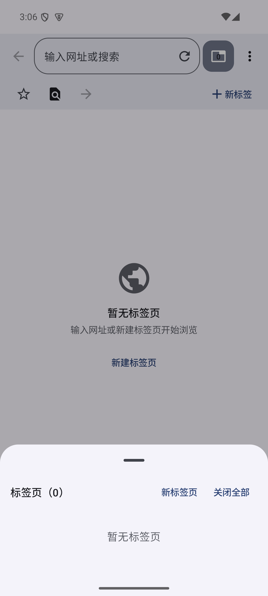
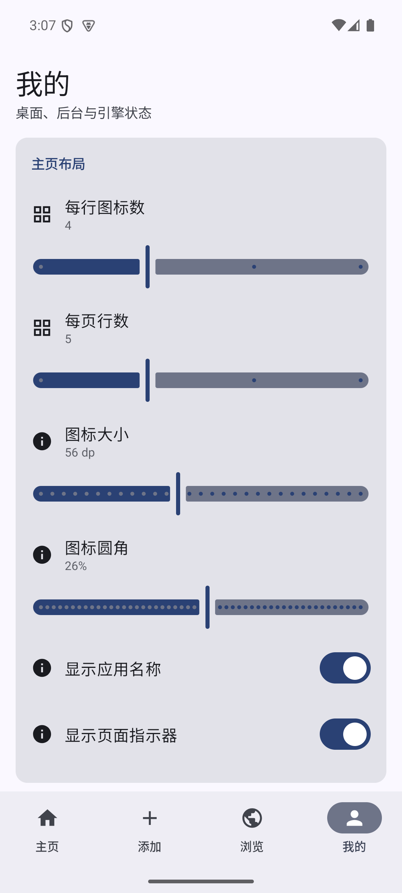

# Android-Web 四版本系统分析与整合记录

## 1. 项目目标

四套工程都在解决同一个问题：把常用网站封装成接近原生 App 的手机入口。用户添加 URL，应用解析站点信息并生成桌面图标；点按图标后由 WebView 运行站点，同时提供浏览标签、站点级显示策略、后台运行、通知与电池设置。

这并不是把网页编译成独立 APK，而是一个多站点、多会话的 Android Web Shell / 轻量桌面。产品体验的关键不只在 WebView 能否打开网页，还包括：

1. 站点解析和图标选择是否可靠；
2. 大量站点下桌面是否仍有稳定的空间模型；
3. 拖动是否像手机 Launcher，而不是列表重排动画；
4. 标签页和会话状态是否始终指向当前 WebView；
5. 后台运行相关文案是否符合 Android 实际约束。

## 2. 分析范围与验证方法

本次阅读了四套工程的 README（GLM 原版没有 README）、Gradle 配置、数据模型、主页、添加流程、浏览器、WebView 内核、设置页、服务实现与测试。源码规模统计排除了 `build/` 内生成文件：

| 版本 | Kotlin 文件 | Kotlin 行数 | 定位判断 |
|---|---:|---:|---|
| DeepSeek | 36 | 3819 | 功能面较宽，实用设置较多 |
| GLM / 智谱 | 43 | 4625 | 架构和网站解析最完整，最适合作为基线 |
| ChatGPT | 26 | 2178 | 设计与边界说明较成熟，但运行内核不完整 |
| Grok | 32 | 2258 | 会话与设置呈现直接，整体实现偏轻 |

四套归档工程都分别执行过 `:app:assembleDebug`，均构建成功；因此比较基于可编译源码，而不是只依据文档中的功能声明。

## 3. 四版本交叉比较

### 3.1 GLM / 智谱

优势：

- 模块划分最完整：`core:model`、`core:data`、`core:webengine` 与四个 feature 的边界清楚。
- 添加网站链路最好：URL 规范化、HTML 元数据解析、图标候选排序和兜底路径较系统，并有针对解析器的测试。
- WebView 能力最深：具有 ShellWebView、池化、站点配置、本地资源加载和多 Profile 兼容处理。
- 浏览器、多标签、运行会话和站点属性形成了相对完整的主流程。

原版问题：

- 浏览器监听器在 `remember` 中捕获首帧的 `activeTabId`，ShellWebView 又只在 session 创建时设置 listener。切换标签后，页面标题和进度仍可能更新旧标签，表现为右上角标签切换“不好使”或状态错乱。
- `AppIcon` 接收了 `size`，但根节点没有真正应用 `Modifier.size(size)`。图标子内容因远程图片、文件夹预览或文字兜底而得到不同测量结果，这是页面忽大忽小和网格单元被撑开的直接原因。
- 主页硬编码为 4 列、56dp，行数、图标大小、标题和页码设置虽然写入 DataStore，却完全没有被主页读取。
- 分页沿用数据库中已有 `page/index`，没有按当前行列容量重新切页；站点多时，同一页继续增长，形成横跨、滚动和对不齐。
- 原拖动只是对 LazyGrid 内的原图标做缩放；拖动对象仍参与布局测量，Pager 仍可响应，网格和翻页手势同时竞争，容易出现“整个屏幕缩小”和布局跳动。
- 电池设置回调在应用壳中没有接线，实际为空操作；全局保活开关只改本地 UI 状态，既不持久化，也不控制服务。

结论：GLM 的数据层和 Web 内核是四者中最值得保留的，但主页交互与设置接线需要结构性修复，单纯调 padding 或动画参数无法解决。

### 3.2 ChatGPT

优势：

- 视觉层次和默认配色更克制，蓝灰回退色在不支持动态色的设备上更稳定。
- 通知授权、电池优化入口和后台限制说明比其他版本真实；没有把“前台服务”宣传成永久不被系统回收。
- URL 规范化与契约测试思路清楚，功能范围说明也更诚实。
- 设置项组织较好，用户能理解哪些是应用开关，哪些要去系统设置完成。

不足：

- 浏览器运行层与 UI 更像阶段性骨架，多标签宿主和当前会话联动不如 GLM 完整。
- 拖动仍偏向列表/行内位置跳转，没有独立 DragLayer、目标热点、跨页悬停等 Launcher 状态机。
- 保活能力有意收缩为一个可见会话，产品边界正确，但不能直接替代 GLM 的多会话架构。

迁移选择：采用其动态色回退配色、系统通知/电池入口和后台限制表述；没有迁移其未完成的浏览内核。

### 3.3 Grok

优势：

- SessionRegistry 和运行列表实现简洁，状态展示直接，较少出现 UI 声称已运行而控制层没有对象的问题。
- 页面结构、设置卡片和主题相对稳定，没有过度复杂的视觉动画。
- 代码路径短，容易理解和维护。

不足：

- 网站解析、浏览器标签宿主和 WebView 配置深度明显弱于 GLM。
- 主页没有完整的桌面式重排/文件夹/跨页拖动机制。
- 自动化测试覆盖较少；保活服务更多反映启动时快照，没有 GLM 会话层的扩展余量。

迁移选择：借鉴其运行会话状态与设置页的直接呈现方式，保留 GLM 的会话控制和 WebView 内核。

### 3.4 DeepSeek

优势：

- README 与功能入口较完整，设置、资料与实际使用场景覆盖面广。
- 使用 Reorderable 组件处理列表/网格位置变化，比完全手写位置交换更容易达到基础可用。
- 工程规模仅次于 GLM，很多功能不是纯界面占位。

不足：

- Reorderable 解决的是 Compose 容器内的排序，不天然等同 Android Launcher 的 DragController + DragLayer；跨页、文件夹热点、边缘停留和固定占位仍需额外状态机。
- 数据/Web 内核模块化程度和站点解析测试不及 GLM。
- 一些 WebView/Cookie 能力仍以全局进程行为为主，站点隔离和多会话扩展性较弱。

结论：它适合作为功能清单和基础排序参考，但不足以替代 GLM 基线。

## 4. Android Launcher 交互研究与根因

AOSP Launcher3 的拖动并不是“给原 View 加一个 scale 动画”。Workspace 维护独立的拖动模式、目标 cell、文件夹创建计时和重排计时；DragController 启动一个位于 DragLayer 中的 DragView。DragView 保存触点在图标内部的 registration point，并在 Workspace 原图标之上独立缩放和移动。

Compose 的指针事件在首次命中后会沿既定 hit chain 分发，长按拖动还需要消费位移；如果同一手势同时留给 HorizontalPager、LazyGrid 和图标节点，Pager 翻页与图标拖动会竞争。另一方面，响应式布局应使用当前 composable 的实际可用宽度约束，而不是按“典型手机宽度”硬编码尺寸。

原 GLM 版恰好违背了这三点：拖动对象没有脱离网格测量、Pager 没有在拖动时停用、图标根节点又没有固定尺寸。三者叠加后，远程图标的测量、原图标的缩放和 Pager 的位移会一起触发布局重算，于是出现整页缩放、图标横跨和页面坍塌。

本次采用的状态关系为：

```text
长按命中图标
  → 原网格 cell 保留尺寸，仅降低透明度
  → DragLayer 按 registration point 绘制独立浮层
  → 拖动期间关闭 Pager 手势
  → 普通目标：松手重排
  → 中心热点停留 500ms：武装文件夹合并
  → 左右边缘停留 450ms：切换页面
  → 松手：一次性持久化 page/index 或文件夹关系
```

实现中特别修复了一个容易忽略的时序：第一次 MOVE 事件可能早于 `draggedCell` 派生状态的重组。如果文件夹候选依赖该派生对象，指针一次进入目标后保持静止时就永远不会启动计时。现在候选判断直接用 `draggingKey` 从当前 pages 同步解析源 cell，因此无需再移动一下才能成文件夹。

## 5. 已完成的主工程改造

### 5.1 稳定主页与大量站点

- 图标根节点强制使用设置后的实际尺寸；远程图标、文件夹预览和文字兜底共享同一几何边界。
- 主页读取 DataStore 中的列数、行数、图标大小、圆角、标题和页码设置。
- 以 `rows × columns` 为固定页容量重新生成桌面页；数据库旧位置只决定顺序，不再允许一页无限增长。
- 最后一页满时额外建立空页放置“添加”，避免入口把最后一行挤出网格。
- 使用 `BoxWithConstraints` 按当前可用宽度夹紧图标尺寸，窄屏不会溢出，宽屏也不会无上限放大。
- LazyGrid 在翻页模式下只作为固定 cell 容器，不在单页内部滚动；上下滚动模式（0.1.11 起，设置可切）则把所有页摊平成一条可滚动的 LazyVerticalGrid，共享同一 `(homePage, homeCellIndex)` 数据模型。

### 5.2 Launcher 式拖动

- 新增独立于 Pager/LazyGrid 测量的 DragLayer。
- 保留触点相对图标的位置，浮层不会在长按瞬间跳到手指中心。
- 拖动源只淡化，不改变 cell 尺寸；浮层使用阴影和轻微放大，不影响布局。
- 拖动时停用 Pager，加入目标命中、文件夹热点、悬停计时、边缘翻页、触觉反馈和取消清理。
- 普通放置写入稠密 `page/index`；合并支持“应用 + 应用”和“应用 + 已有文件夹”。

### 5.3 浏览器标签页

- ShellWebViewHost 每次重组都以 `SideEffect` 更新 listener，不再只在创建 session 时赋值。
- listener 通过 `rememberUpdatedState` 读取当前标签和标题，回调不会写回已经离开的 tab。
- 顶栏按实际宽度响应：标签按钮保持 48dp 点击目标；刷新放入地址栏尾部；紧凑宽度下把次要操作放到第二行/菜单，避免右上角被挤压。

### 5.4 设置与后台机制

- 通知入口使用 Android 系统权限请求；状态在应用回到前台时刷新。
- 电池优化读取 `PowerManager` 实时状态，并打开系统白名单请求页。
- 全局保活开关写入 DataStore，并真正控制前台服务；站点级和全局开关必须同时开启。
- 设置页显示运行会话和 WebView 能力状态，并明确 Doze、厂商策略及内存回收仍可能终止后台页面。
- 迁入 ChatGPT 版的蓝灰回退色；系统支持动态色时继续采用 Material You。

## 6. 验证结果

- 四个归档原版：分别执行 `:app:assembleDebug`，全部成功。
- 当前主工程：`feature:home:testDebugUnitTest`、`feature:add:testDebugUnitTest` 与 `app:assembleDebug` 联合执行成功，共 224 个 Gradle task。
- 新增主页容量测试：验证大量站点会按固定容量分页；最后一页满时，“添加”入口进入新页而不是溢出。
- Android API 35 模拟器实测：
  - 右上角标签按钮能打开标签切换器；
  - 通知项能打开系统权限对话框；
  - 电池项能进入系统电池优化白名单界面；
  - 两站点主页保持固定对齐；
  - 长按拖动中，源 cell 保持占位、浮层独立移动、整页不缩放；
  - 在目标中心悬停后松手，两站点成功持久化为文件夹。

关键画面保存在 `docs/verification/`：

| 标签切换器 | 设置页 |
|---|---|
|  |  |

| 拖动中的独立浮层 | 松手后的文件夹结果 |
|---|---|
|  |  |

## 7. 已知边界与后续建议

- Android 不允许普通应用无条件保证 WebView 永久在后台运行。前台服务、电池白名单和通知权限只能提高存活概率，不能覆盖 Doze、OEM 策略、低内存回收和网页自身节流。
- 当前文件夹使用默认名称“文件夹”；后续可加重命名、拆出成员和文件夹内排序。
- 跨页边缘停留已实现，建议在小屏、折叠屏和至少一台高刷新率实体机上补充手势回归。
- 远程站点图标加载结果受网站、网络和防盗链影响；固定几何边界已保证加载失败不会破坏布局，但可继续增加磁盘缓存和候选来源诊断。
- 建议下一阶段增加 Compose UI 测试：标签切换后的回调归属、不同网格设置的黄金截图、跨页拖动和进程重启后的顺序持久化。

## 8. 参考依据

- AOSP Launcher3 `Workspace.java`：拖动模式、目标 cell、文件夹/重排计时与 DragController。
  https://android.googlesource.com/platform/packages/apps/Launcher3/+/f26d98e/src/com/android/launcher3/Workspace.java
- AOSP Launcher3 `DragView.java`：位于 DragLayer 的独立拖动视图及 registration point。
  https://android.googlesource.com/platform/packages/apps/Launcher3/+/d009101/src/com/android/launcher3/DragView.java
- Android Developers，Compose gestures：长按拖动、事件分发与消费。
  https://developer.android.com/develop/ui/compose/touch-input/pointer-input/understand-gestures
- Android Developers，Adaptive layouts：依据实际可用窗口/布局宽度构建响应式界面。
  https://developer.android.com/develop/adaptive-apps/guides/support-different-display-sizes
- Android Developers，Constraints and modifier order：约束传播与 Modifier 顺序对测量的影响。
  https://developer.android.com/develop/ui/compose/layouts/constraints-modifiers
