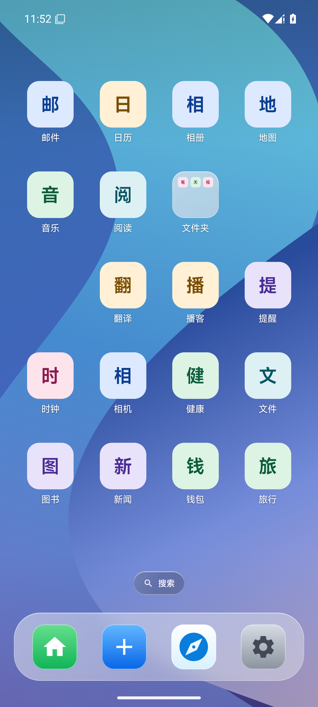
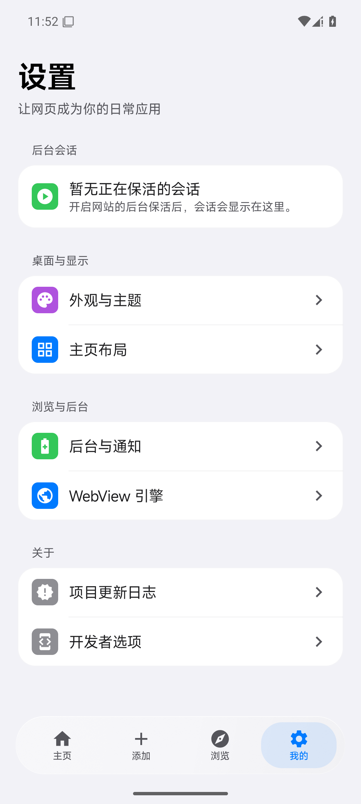
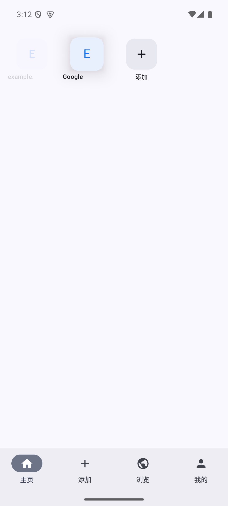
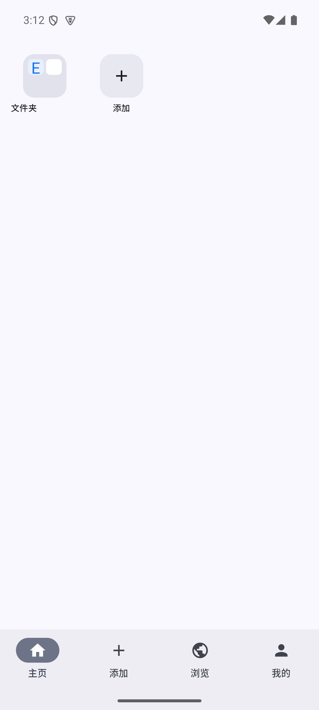

# PocketWebShell

> 把常用网站变成一个可整理、可拖动、可多会话运行的 Android 口袋桌面。

[](https://developer.android.com/)
[](https://kotlinlang.org/)
[](https://developer.android.com/compose)
[](LICENSE)
[](https://github.com/AIMFllyYS/PocketWebShell/releases/latest)

PocketWebShell（应用内名称为 **WebShell**）是一款面向手机的多站点 Web Shell。输入网址后，它会解析站点标题和图标，生成类似桌面 App 的入口；入口可以固定容量分页、重排或组成文件夹，并以独立 WebView 会话运行。项目同时提供多标签浏览、站点显示策略、通知、电池优化和后台服务设置。

English summary: PocketWebShell turns websites into organized, launcher-style Android entries with metadata discovery, fixed-grid pages, folders, multi-tab browsing, and isolated WebView sessions.

## 为什么做这个项目

普通浏览器书签适合“收藏”，但不擅长高频站点的手机化组织。PocketWebShell 关注的是更接近 Launcher 的使用方式：

- 添加后直接出现在桌面网格；
- 图标尺寸和页容量稳定，不因远程图片改变布局；
- 长按后由独立 DragLayer 跟随手指，原位置保留占位；
- 普通区域松手重排，中心悬停合并文件夹，边缘悬停跨页；
- 每个站点保留自己的显示和运行策略。

## 功能

- **网站添加**：URL 规范化、HTML 元数据解析、多来源图标候选与保存前编辑。
- **手机桌面**：可配置行列、图标大小、圆角、标题和页码。
- **稳定分页**：按 `rows × columns` 固定容量分页；满页时“添加”入口自动进入新页。
- **Launcher 式拖动**：独立浮层、触点 registration point、触觉反馈、重排、文件夹热点和边缘翻页。
- **多标签浏览**：地址栏、返回、前进、刷新、新建标签和标签切换器。
- **多会话 WebView**：站点配置、WebView 池、Profile 兼容和本地资源加载。
- **系统状态联动**：通知运行时权限、电池优化白名单状态和前台服务开关。

## 界面

| iOS 风格主屏 | 分组设置 |
|---|---|
|  |  |

0.1.14 将桌面、玻璃 Dock、文件夹、菜单和功能页统一为 iOS 风格的原生 Compose 呈现。设计边界、结构性性能优化与实际检查结果见 [重构说明](docs/IOS_REDESIGN.md) 和 [验收记录](docs/verification/ios-0.1.14/VERIFICATION.md)。上图使用离线测试数据和图标加载兜底。

下方是拖拽机制的历史验收截图，仅展示交互行为，不代表当前视觉：

| 独立拖动浮层 | 文件夹合并结果 |
|---|---|
|  |  |

## 架构

```text
app/                 应用壳、Navigation 3、底部导航、会话与前台服务控制
core/model/          跨模块领域模型
core/data/           Room、DataStore、Repository 与持久化设置
core/designsystem/   iOS 风格 token、Haze 材质、菜单与原生组件
core/webengine/      ShellWebView、池化、站点配置、Profile 与资源加载
feature/home/        固定桌面、分页、文件夹与 DragLayer
feature/add/         URL、元数据、图标候选与属性编辑
feature/browser/     多标签浏览器与标签切换器
feature/me/          桌面、通知、电池、后台运行和会话设置
```

状态和持久化遵循单向数据流：Composable 负责呈现与事件，ViewModel 暴露 `StateFlow`，Repository 负责 Room/DataStore，平台对象和 WebView 生命周期留在专用宿主与控制器中。

## 环境要求

- JDK 17
- Android SDK 37
- Android 10 / API 29 或更高
- Windows、macOS 或 Linux；仓库自带 Gradle Wrapper

主要版本：AGP 9.3.2、Kotlin 2.4.10、Jetpack Compose、Room 2.8.4、DataStore 1.2.1、Hilt 2.60.1、AndroidX WebKit 1.17.0。

## 快速开始

```powershell
git clone https://github.com/AIMFllyYS/PocketWebShell.git
cd PocketWebShell
.\gradlew.bat :app:assembleDebug
```

macOS / Linux：

```bash
./gradlew :app:assembleDebug
```

Debug APK 输出到 `app/build/outputs/apk/debug/app-debug.apk`。

## 测试

提交前的最小验证：

```powershell
.\gradlew.bat :feature:home:testDebugUnitTest :feature:add:testDebugUnitTest :app:assembleDebug
```

修改 WebView、会话、设置或应用壳时，执行完整单元测试和构建：

```powershell
.\gradlew.bat testDebugUnitTest :app:assembleDebug
```

更详细的按模块验证矩阵见 [AGENTS.md](AGENTS.md)。

## 安装 Release

从 [GitHub Releases](https://github.com/AIMFllyYS/PocketWebShell/releases) 下载：

- `PocketWebShell-vX.Y.Z.apk`：使用项目长期发布证书签名的安装包；
- `PocketWebShell-vX.Y.Z.apk.sha256`：SHA-256 摘要；
- `PocketWebShell-release-cert.pem`：用于核对签名者的公开证书，不包含私钥。

维护者签名流程见 [docs/RELEASE.md](docs/RELEASE.md)。密钥和密码永远不进入仓库。

## 分支与贡献

- `main`：稳定、可发布分支；Release 标签只从这里创建。
- `dev`：日常集成分支。
- 功能分支：从 `dev` 创建，命名为 `feat/<topic>`、`fix/<topic>` 或 `docs/<topic>`。
- 提交采用 [Conventional Commits](https://www.conventionalcommits.org/)。

贡献流程、变更范围和 PR 检查清单见 [CONTRIBUTING.md](CONTRIBUTING.md)。编码代理和自动化工具必须同时遵守 [AGENTS.md](AGENTS.md)。

## 后台运行的边界

“后台保活”表示在站点开关和全局开关同时开启时使用 Android 前台服务，尽可能维持进程。它不能绕过 Doze、厂商省电策略、低内存回收或网页自身的后台节流。通知权限、前台服务通知和电池优化白名单仍由系统及用户控制。

## 项目记录

- [CHANGELOG.md](CHANGELOG.md)：版本变更。
- [PROJECT_ANALYSIS.md](PROJECT_ANALYSIS.md)：四个早期实现的系统比较、布局根因和整合决策。
- [SECURITY.md](SECURITY.md)：漏洞报告与 WebView 安全边界。
- [docs/RELEASE.md](docs/RELEASE.md)：签名、验签和 GitHub Release 流程。

## License

Apache License 2.0。详见 [LICENSE](LICENSE)。
