# 0.1.52 · 截图验收

日期：2026-09-14

对照版本：`versionName=0.1.52` / `versionCode=53`（开发者选项页可见）

交付形态：已安装到专用模拟器的 Debug 包 `PocketWebShell-v0.1.52-debug.apk`。截图全部来自应用真实运行，不是设计稿。

## 验证环境

- Windows，仓库 Gradle Wrapper，Android SDK 37。
- AVD：`webshell-ios-qa-api35`，Android 15 / API 35 / x86_64。
- 屏幕：1080×2400 px，density 420（约 411 dp 宽）。
- 设备上预置 GitHub、Wikipedia、YouTube 三个主屏应用；端测中另外导入了本地 HTML，并合并了一个文件夹。
- 网页加载走真实网络（Wikipedia、Bing、YouTube）；Markdown / HTML 用本机 `Download/` 文件通过 `VIEW` 打开。

本文件按产品板块收录截图。README 只放主屏、设置、拖动和文件夹四张当前视觉；更细的页面都在这里。

未覆盖：开屏黑洞动画（瞬时，adb 截不到稳定中间帧）、历史分组列表本体（菜单入口已拍到，制作应用成功弹窗反复盖住历史页）、保活分屏条（需要两个同时保活的站点壳；本次只有 YouTube 一个前台会话）。

---

## 功能地图（按近期版本）

下面是值得单独验收的能力，以及它们大致是哪一版定下来的。截图对应当前 0.1.52，不表示该功能只在那一版出现。

| 版本 | 板块 | 这次拍到的东西 |
|---|---|---|
| 主线 | 主屏网格、玻璃 Dock、添加、浏览、我的 | 01、11、15、35 |
| 主线 | 长按菜单、空白长按、编辑态、拖动、文件夹 | 02、03e、04、05、06、08 |
| 0.1.45 | 站点壳悬浮球、保活分屏条、新窗口策略 | 28、29、39 |
| 0.1.46 | 浏览菜单「制作应用」、本地路径地址栏 | 64、65、63 |
| 0.1.48 | Markdown 全屏站点壳、原始文件名、无顶栏 | 57、58 |
| 0.1.49 | 站点图标、存储卡片弹簧撑开、历史图标 | 48、41、17 |
| 0.1.50 | 更新日志 20 条、历史时间分组 | me-updates、16 |
| 0.1.52 | 开屏最终流程、空主页不再叠广告语 | 开发者选项版本号 |

---

## 1. 主屏

### 1.1 桌面网格与玻璃 Dock

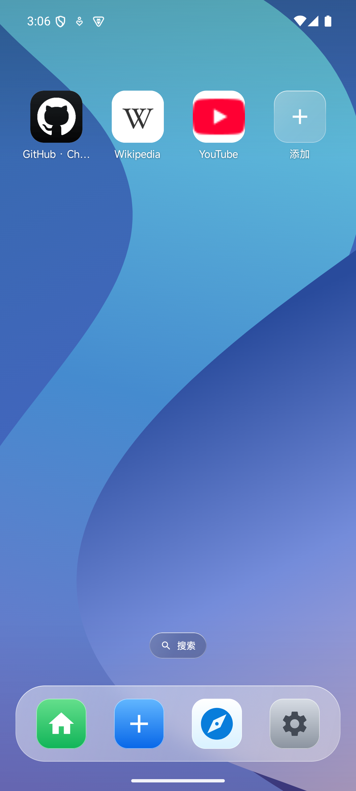

固定 4 列网格。GitHub、Wikipedia、YouTube 和「添加」各占一格。底部是 iOS 风格玻璃 Dock：主页 / 添加 / 浏览 / 我的，主页为选中色。搜索胶囊浮在 Dock 上方，不参与网格测量。壁纸是浅色抽象曲线，图标圆角和标题截断与当前设计 token 一致。

### 1.2 应用长按菜单

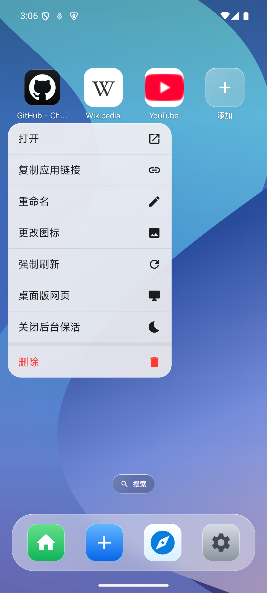

长按 GitHub 后弹出情境菜单：打开、复制应用链接、重命名、更改图标、强制刷新、桌面版网页、关闭后台保活、删除。删除为红色危险项。菜单是浮动卡片，Dock 和搜索仍在。

### 1.3 空白区域长按

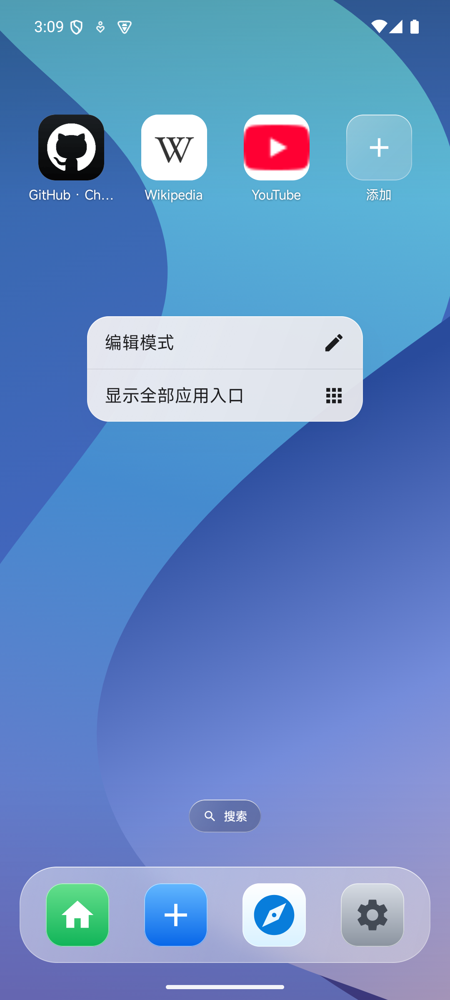

长按主屏空白处：编辑模式、显示全部应用入口。这是进入抖动编辑态的入口之一，也是「全部应用 / App 资源库」开关。

### 1.4 编辑模式

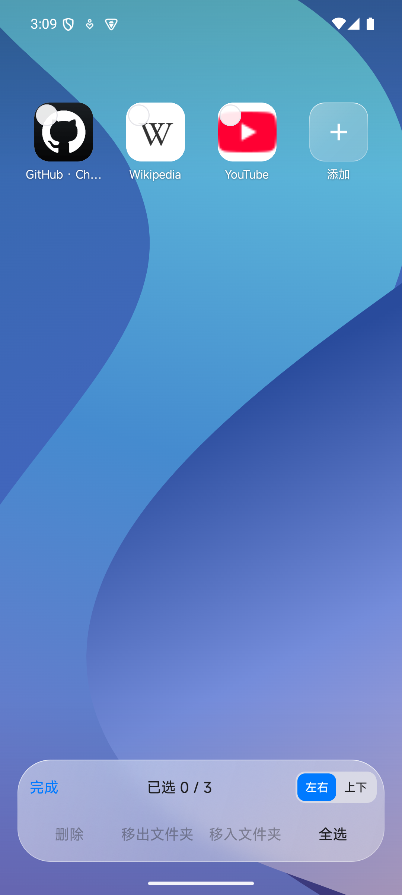

图标左上角出现选择圆点。Dock 换成编辑工具条：完成、已选 0/3、左右/上下滚动、删除、移出文件夹、移入文件夹、全选。编辑态不再弹出长按菜单，位移超过 touchSlop 即进入拖动。

### 1.5 独立拖动浮层

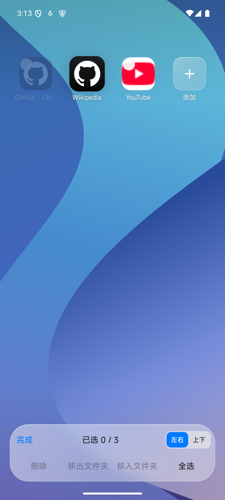

把 GitHub 拖到 Wikipedia 格子上。源位置留下半透明占位，浮动图标在 DragLayer 里跟随手指，不参与网格测量。底栏仍是当前编辑条，而不是早期实心底导航。

### 1.6 文件夹合并

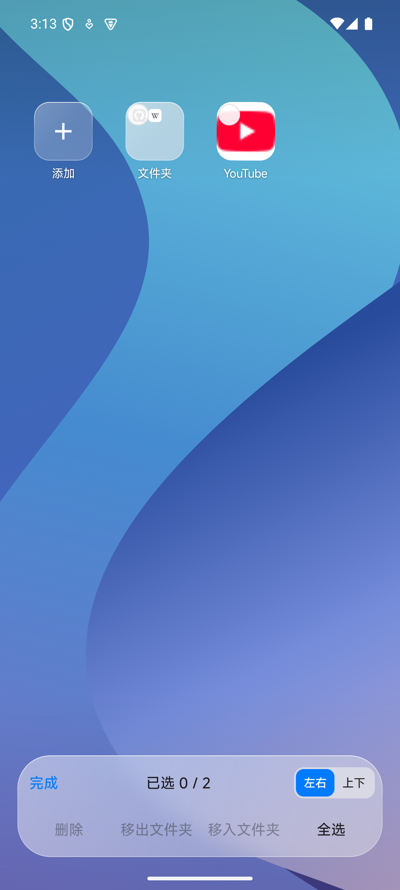

悬停约 500ms 后松手，GitHub 与 Wikipedia 收进「文件夹」。添加格回到首位，YouTube 仍在第三格。编辑条已选变为 0/2。

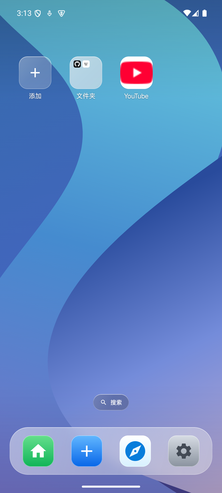

点「完成」后回到普通桌面。文件夹缩略图里能看到两个应用图标，玻璃 Dock 恢复。

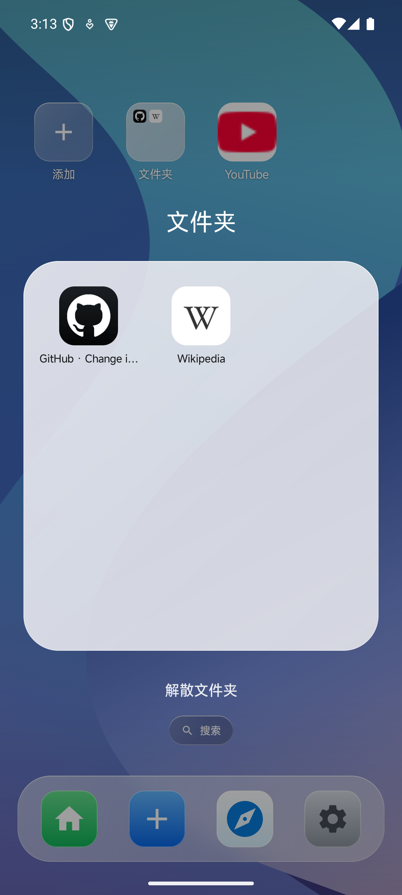

点文件夹进入展开页：大卡片里是 GitHub 和 Wikipedia，底部有「解散文件夹」，搜索和 Dock 仍在。背景主屏被压暗。

### 1.7 App 资源库

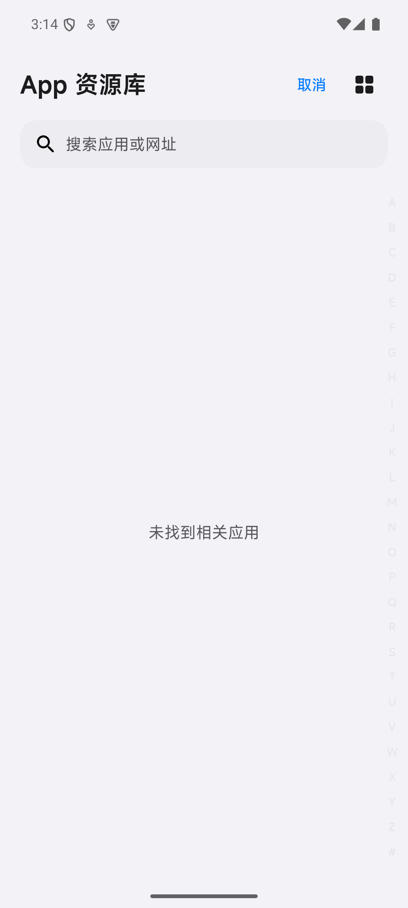

点搜索胶囊进入「App 资源库」：搜索应用或网址、A–Z 侧边索引、网格/列表切换。空态文案是「未找到相关应用」（当时应用都在文件夹里，资源库按当前索引显示）。

### 1.8 制作应用之后的主屏

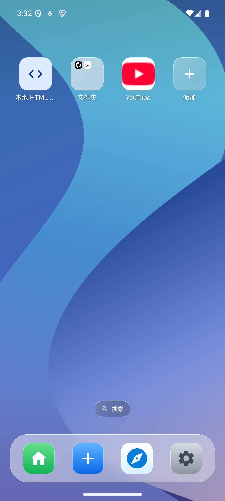

从浏览菜单把本地 HTML「制作应用」后，主屏第一格出现代码块图标「本地 HTML …」，文件夹、YouTube、「添加」顺延。这是本地 HTML 与网站图标的视觉区别（Markdown 用文档 M 标，HTML 用 `<>`）。

---

## 2. 添加网站

### 2.1 添加页

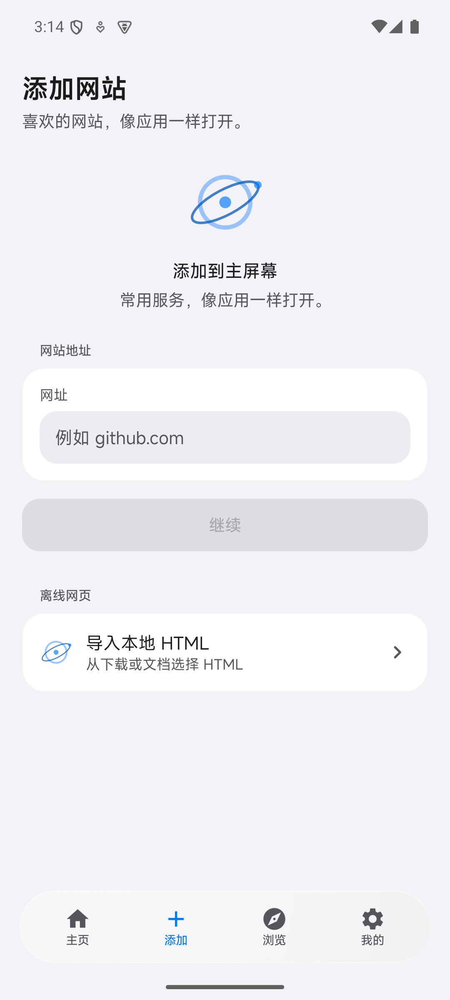

标题「添加网站」。中间品牌标、网址输入（示例 github.com）、灰色「继续」、离线网页分组里的「导入本地 HTML」。底栏「添加」高亮。

### 2.2 输入网址

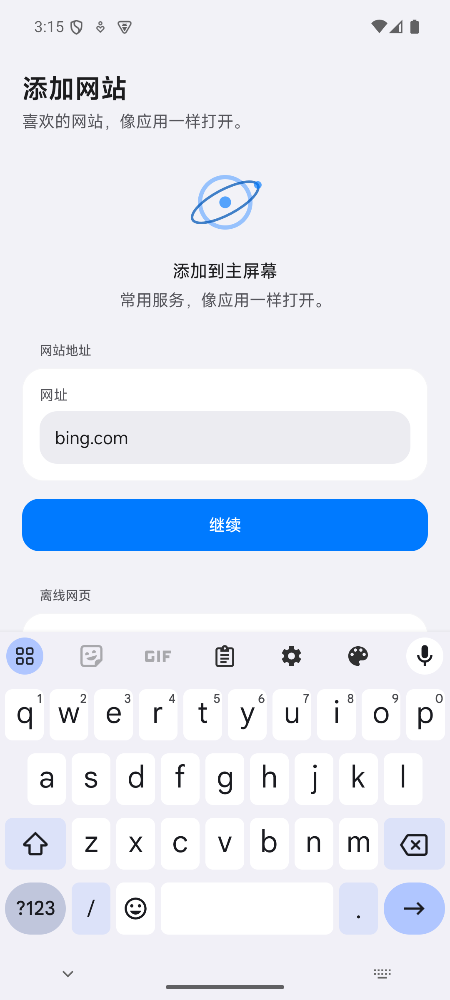

输入 `bing.com` 后「继续」变为可点的蓝色主按钮。系统键盘打开。

### 2.3 拉取元数据

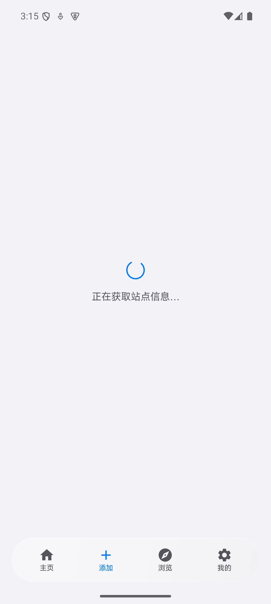

点继续后全屏进度：「正在获取站点信息…」。网络与解析在后台线程。

### 2.4 编辑草稿

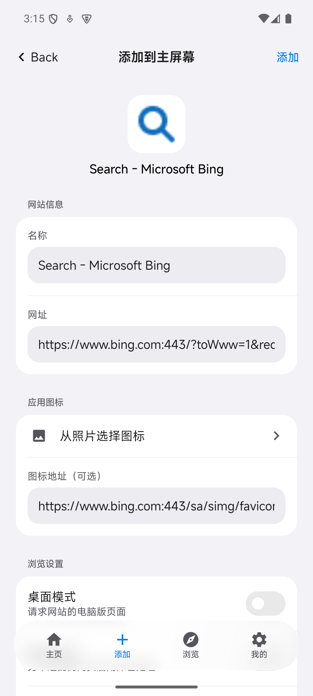

解析到 Bing 标题、规范化网址、候选 favicon。可改名称、网址、从照片选图标、填图标地址。右上角「添加」。

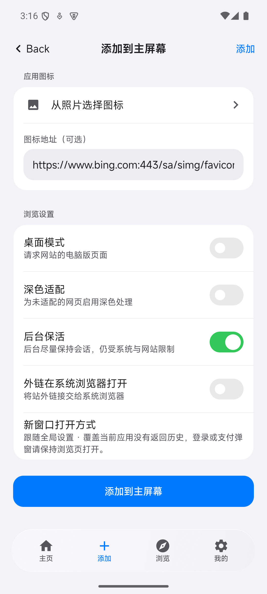

下半段：桌面模式、深色适配、后台保活（默认开）、外链在系统浏览器打开、新窗口打开方式（跟随全局）。最下是「添加到主屏幕」。本次未保存 Bing，避免打乱主屏验收数据。

### 2.5 本地 HTML 选择器

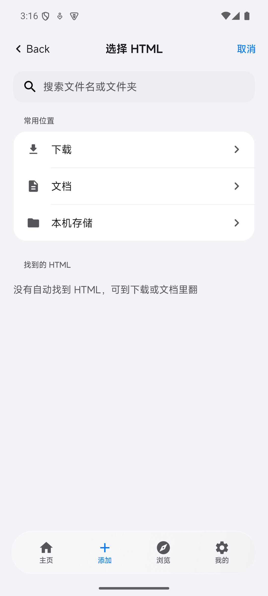

自绘选择页，不是系统文件框。常用位置：下载、文档、本机存储。未授权或目录为空时提示「没有自动找到 HTML」。只显示 `.html` / `.htm`。

---

## 3. 浏览

### 3.1 新标签页

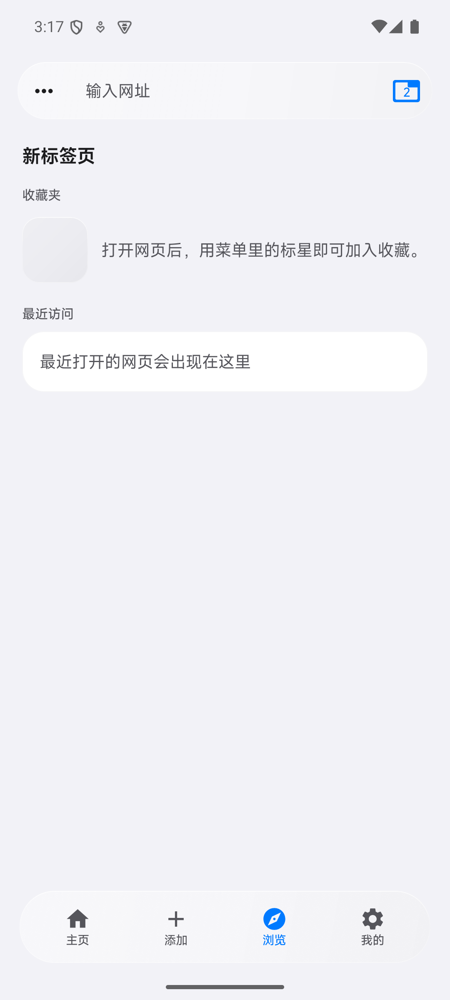

地址栏、菜单、标签计数（当时 2）。正文是新标签页：收藏夹空态、最近访问空态。底栏「浏览」高亮。

### 3.2 浏览菜单

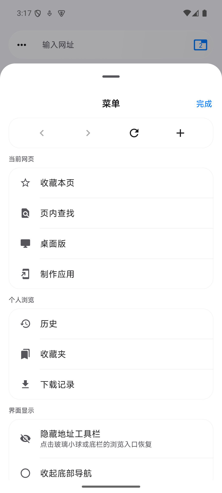

当前网页：收藏本页、页内查找、桌面版、**制作应用**。个人浏览：历史、收藏夹、下载记录。界面显示：隐藏地址工具栏、收起底部导航。顶上是后退 / 前进 / 刷新 / 新标签。

同一菜单在已打开页面上再拍一版：

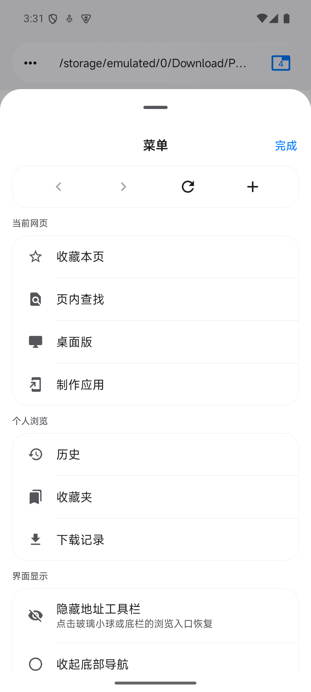

桌面版可打勾。制作应用是 0.1.46 补上的入口：点过「仅查看」之后还能再加到主屏幕。

### 3.3 标签切换器

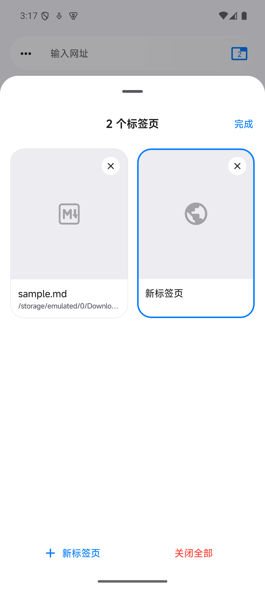

Markdown 文档图标的 `sample.md`（本机路径）和新标签页。底部「新标签页 / 关闭全部」。

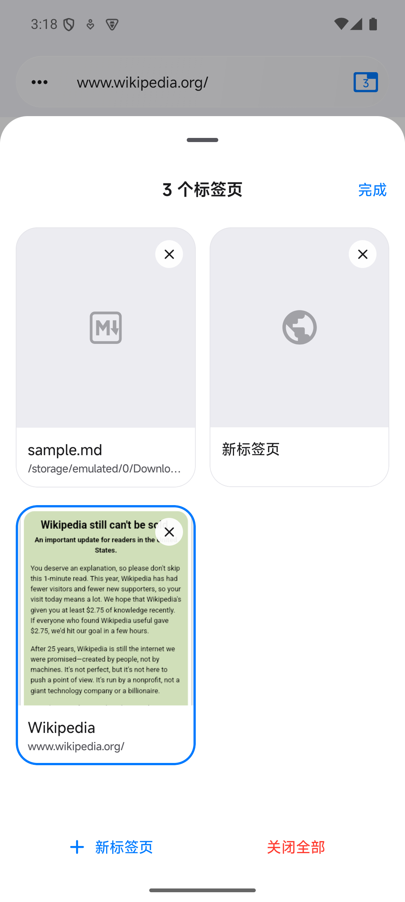

加上 Wikipedia 预览卡。标签页带关闭按钮，选中项有描边。

### 3.4 打开网页

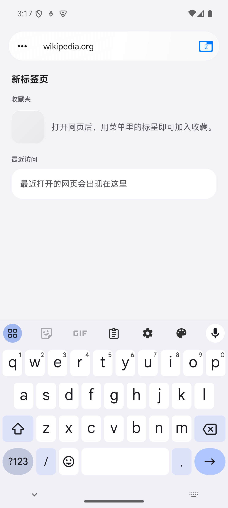

地址栏输入 `wikipedia.org`。

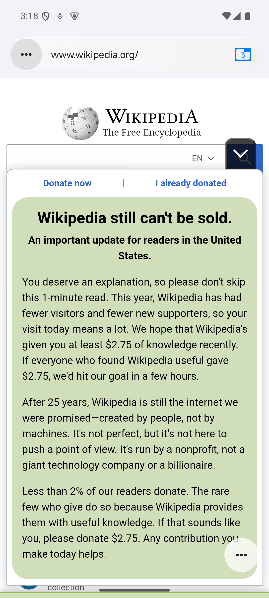

站点加载后地址栏变成 `www.wikipedia.org/`。阅读时底栏按「阅读时自动收起导航」收成右下角小球。页面内容是站点自己的，不代表产品 UI。

### 3.5 站点壳与悬浮球

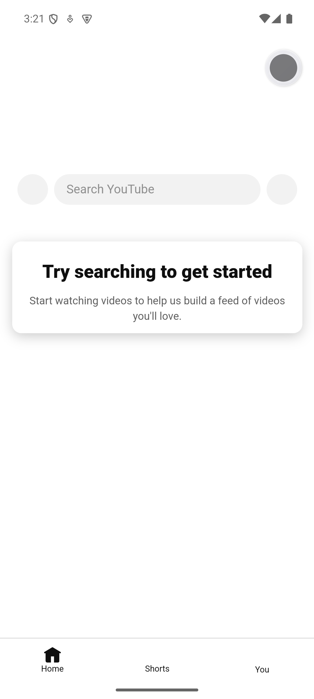

从主屏点 YouTube，进入站点壳而不是浏览标签。右上角灰色玻璃球是站点壳辅助球（uiautomator 节点名「站点壳辅助球」）。没有应用顶栏。

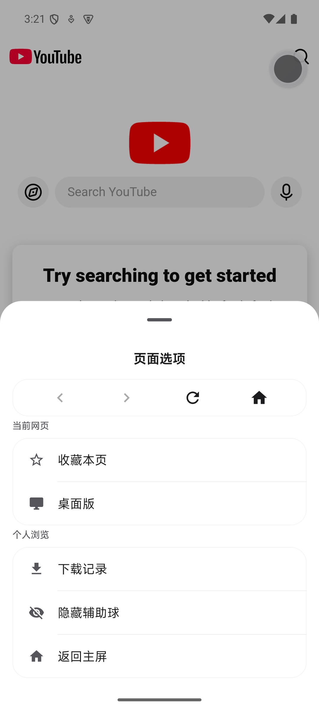

点辅助球：「页面选项」。工具条：后退、前进、刷新、回主屏。当前网页：收藏、桌面版。个人浏览：下载记录、隐藏辅助球、返回主屏。

0.1.45 起，若还有其它保活会话，菜单顶部会出现一条小分屏，点一下切到后台页。本次只有 YouTube 一个保活项，所以没有分屏条。开关在「我的 → 悬浮球与手势」。

### 3.6 桌面版提示

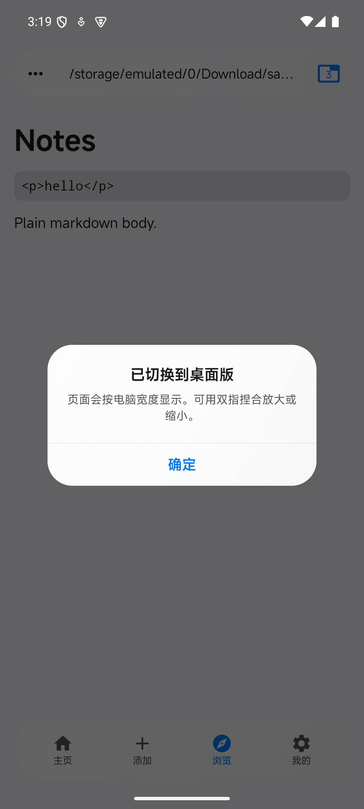

切到桌面版后的说明：按电脑宽度显示，可双指缩放。取消证书错误不会离开页面（0.1.45）。

---

## 4. Markdown 与 HTML 预览

### 4.1 外部打开 Markdown（全屏站点壳）

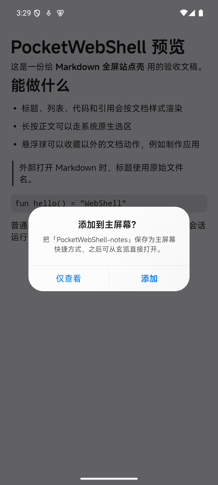

`VIEW` `PocketWebShell-notes.md`。正文已经按 Markdown 渲染（标题、列表、引用、代码块）。中间弹出「添加到主屏幕？」：把「PocketWebShell-notes」存成快捷方式。标题用的是原始文件名，不是内容提供者的垃圾段。

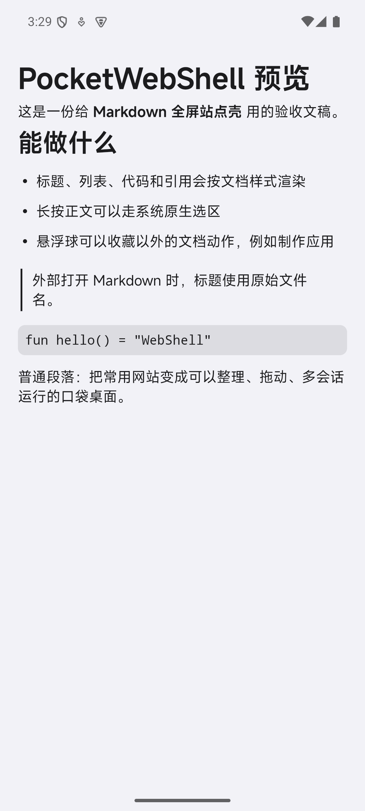

点「仅查看」后去掉对话框。没有顶部导航栏，是 0.1.48 的全屏站点壳。长按正文走系统选区。文档模式的悬浮球会关掉收藏/桌面版，只留制作应用等文档动作（本次功能开关里站点壳球为关，所以这张没有球；YouTube 那张能看到球）。

### 4.2 浏览标签里的旧 Markdown

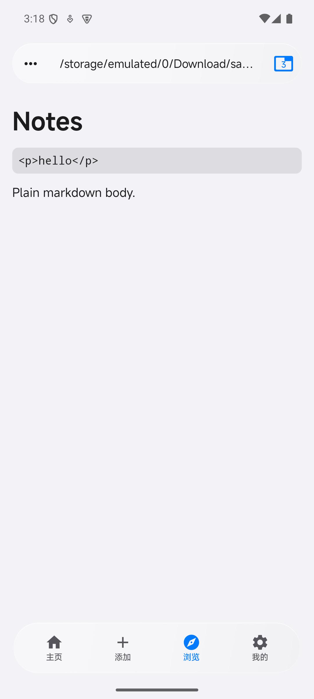

升级前已经打开的 `sample.md` 仍作为浏览标签：地址栏显示 `/storage/emulated/0/Download/sa…`，正文是旧稿。新的外部 Markdown 不再进浏览标签。

### 4.3 本地 HTML

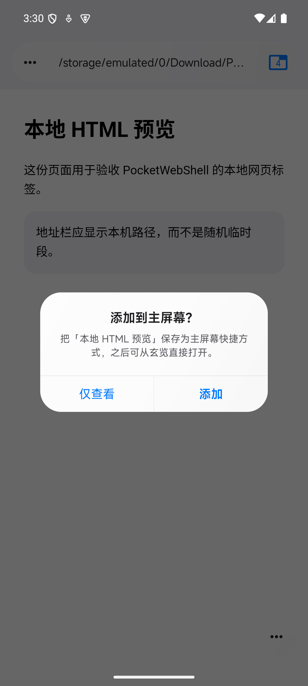

外部打开 HTML 走浏览标签。地址栏是本机路径，不是 `raw%3A` 或 `tmp-` 随机段。同样询问是否加主屏，标题用页面 `<title>`「本地 HTML 预览」。

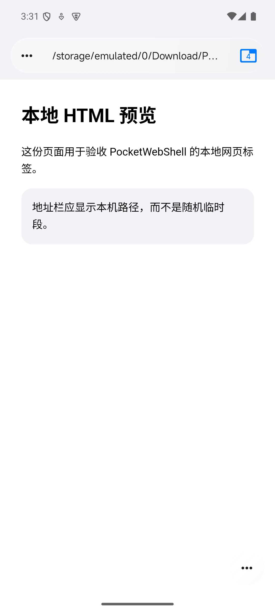

「仅查看」之后的标签。底栏已收起，右下角是恢复导航的小球。

---

## 5. 制作应用

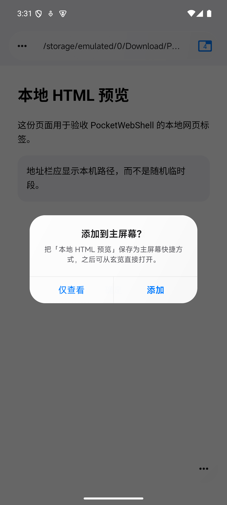

浏览菜单「制作应用」后再次弹出「添加到主屏幕？」——即使刚才点过「仅查看」。

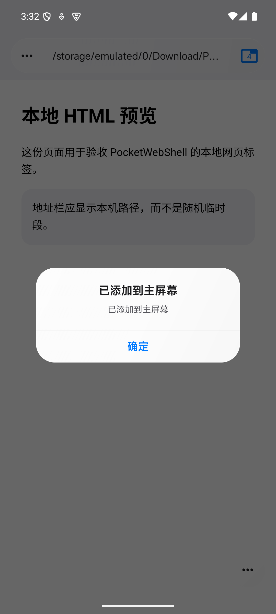

保存成功：「已添加到主屏幕」。回到主屏即可看到代码块图标，见 [1.8](#18-制作应用之后的主屏)。

网站草稿编辑器（Bing 元数据那张）和本地 HTML 制作应用共用同一套「添加到主屏幕」流程，只是来源不同：网址解析 vs 当前标签。

---

## 6. 我的 / 设置

### 6.1 设置首页

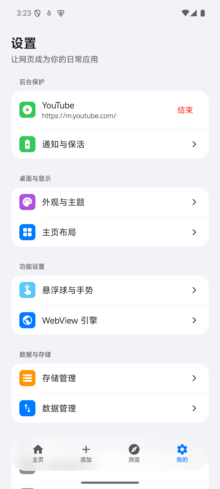

大标题「设置」。分组：

- 后台保护：正在运行的 YouTube 会话（结束）、通知与保活
- 桌面与显示：外观与主题、主页布局
- 功能设置：悬浮球与手势、WebView 引擎
- 数据与存储：存储管理、数据管理

底栏「我的」高亮。关于分组在折叠处下面。

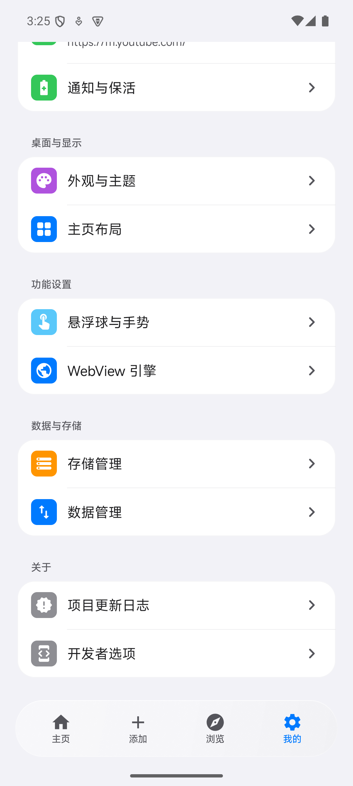

关于：项目更新日志、开发者选项。

### 6.2 通知与保活

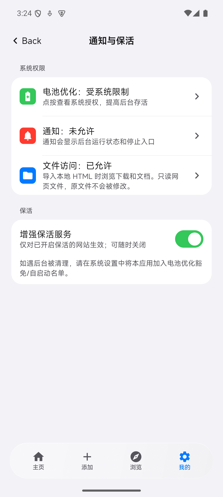

系统权限：电池优化、通知、文件访问（本次已允许）。保活：增强保活服务开关，并写明仍受系统和站点限制。

### 6.3 外观与主题

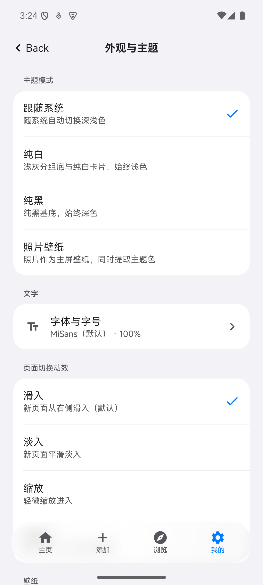

主题：跟随系统 / 纯白 / 纯黑 / 照片壁纸。文字：字体与字号（MiSans 100%）。页面切换：滑入 / 淡入 / 缩放。壁纸入口在 Dock 下面。

### 6.4 字体与字号

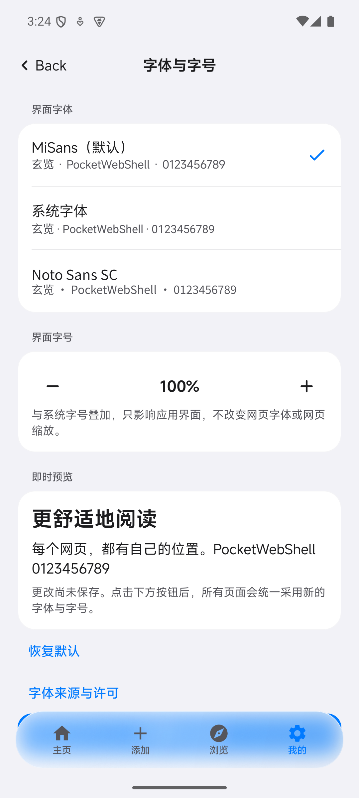

MiSans、系统字体、Noto Sans SC。字号步进，即时预览，恢复默认，字体来源与许可。只影响应用界面，不改网页字体。

### 6.5 主页布局

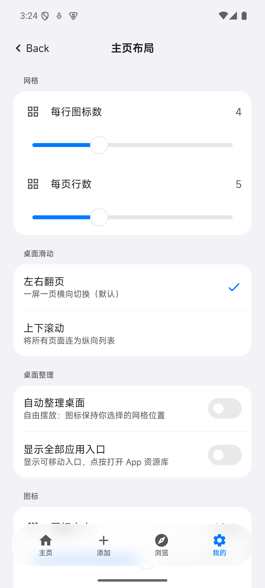

每行图标数、每页行数、左右翻页 / 上下滚动、自动整理桌面、显示全部应用入口。图标大小和圆角滑条在 Dock 下方。

### 6.6 悬浮球与手势

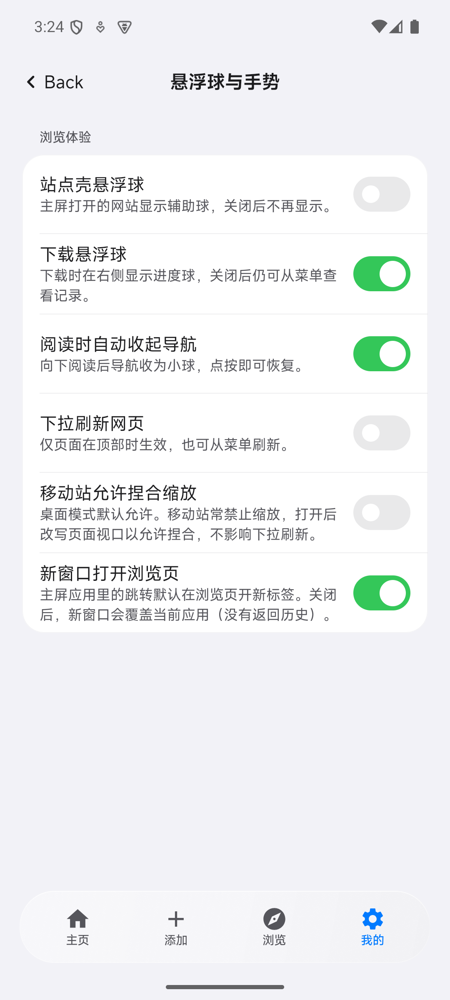

- 站点壳悬浮球
- 下载悬浮球
- 阅读时自动收起导航
- 下拉刷新网页
- 移动站允许捏合缩放
- 新窗口打开浏览页（关则覆盖当前站点壳且没有返回历史）

这是 0.1.45 分屏/新窗口策略的设置面。

### 6.7 WebView 引擎

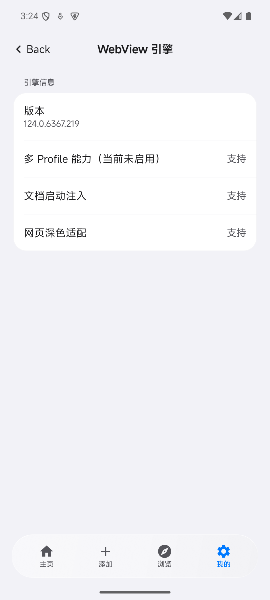

模拟器 WebView 124.0.6367.219。多 Profile（支持但当前未启用）、文档启动注入、网页深色适配。

### 6.8 存储管理

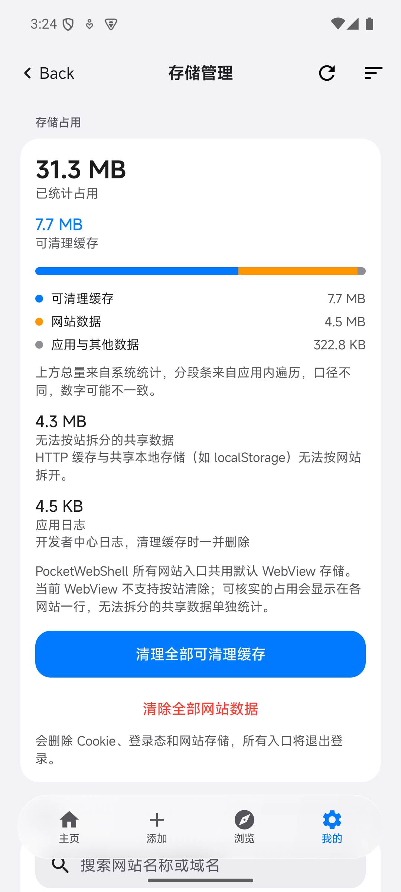

占用卡片：已统计总量、可清理缓存、网站数据、应用与其他数据。共享 HTTP 缓存无法按站拆开。操作：清理全部可清理缓存、清除全部网站数据。卡片从细点弹簧撑开（0.1.49）。

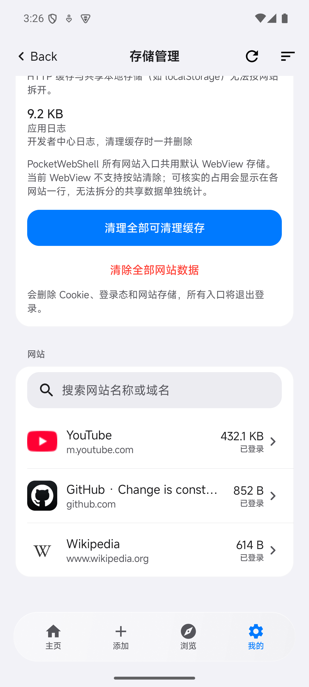

搜索网站名称或域名。YouTube / GitHub / Wikipedia 分行显示占用和「已登录」。点进去是单站清理。

### 6.9 数据管理

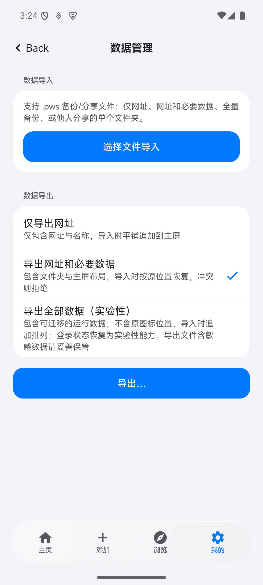

导入 `.pws` 备份。导出：仅网址、网址和必要数据（默认）、全部数据（实验性）。敏感数据提示单独写了。

### 6.10 项目更新日志

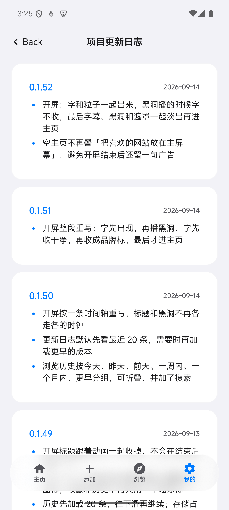

默认最近 20 条。0.1.52 在最上面：开屏字和粒子一起上、黑洞期间字幕不收、空主页不再叠广告语。往下是 0.1.51、0.1.50、0.1.49。到底部可「加载更多」。

### 6.11 开发者选项

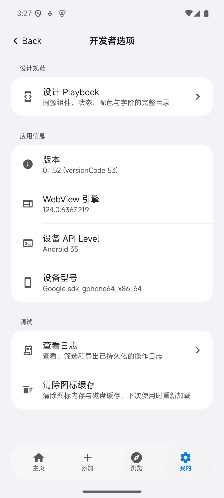

设计 Playbook、版本 `0.1.52 (versionCode 53)`、WebView、API 35、设备型号、查看日志、清除图标缓存。

### 6.12 设计 Playbook

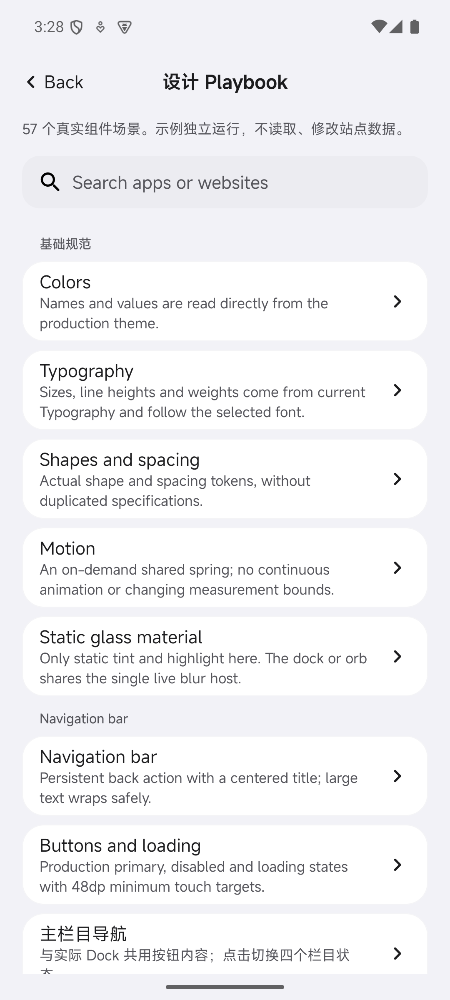

57 个真实组件场景，不读写站点数据。Colors、Typography、Shapes、Motion、Static glass、Navigation bar、主栏目导航。演示层不增加第二处实时模糊。

---

## 7. README 用图对照

README 主表应使用本目录当前视觉，不要再用 `docs/verification/webshell-drag-*.png`（那是早期实心底导航）。

| README 位置 | 文件 | 为什么换 |
|---|---|---|
| 主屏 | [01-home.png](01-home.png) | 当前玻璃 Dock 与真实站点图标 |
| 设置 | [35-me-home.png](35-me-home.png) | 当前分组设置首页 |
| 拖动 | [05-home-drag.png](05-home-drag.png) | 独立浮层 + 当前编辑条 |
| 文件夹 | [08-folder-open.png](08-folder-open.png) | 展开文件夹 + 当前 Dock |

---

## 8. 已知限制

- 开屏 0.1.52 最终流程（字和粒子同时上、黑洞期间字幕保留、整层淡出）需要冷启动眼看，截图只能拍到进主页之后。
- 历史时间分组（今天 / 昨天 / 前天 / 一周内 / 一个月内 / 更早）和搜索框在 0.1.50 已落地，菜单入口见 16、64；本次点「历史」时「已添加到主屏幕」弹窗反复出现，没有进入列表页。
- 悬浮球保活分屏条需要至少两个保活站点壳。本次只有 YouTube 在跑。
- Wikipedia 首页是站点自己的捐款层，不是产品 UI。
- 模拟器 WebView 与真机厂商 WebView、通知权限、电池白名单仍要以真机为准。
